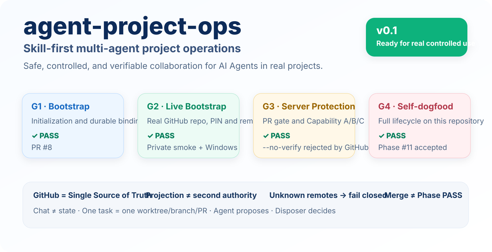
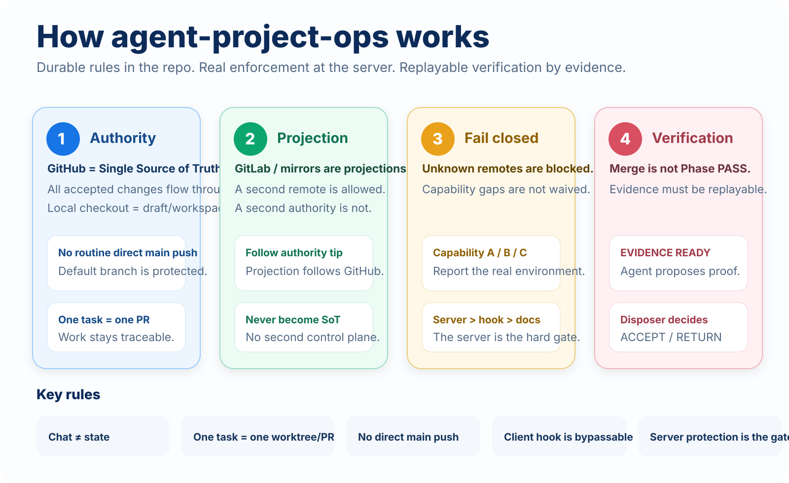

<p align="right">
  <strong>English</strong> · <a href="./README.zh-CN.md">简体中文</a>
</p>

<p align="center">
  
</p>

<p align="center">
  <a href="./LICENSE"></a>
  
  
  
  <a href="https://github.com/Dylan5237/agent-project-ops/actions/workflows/bootstrap-contract.yml"></a>
  <a href="https://github.com/Dylan5237/agent-project-ops/actions/workflows/enforcement-contract.yml"></a>
</p>

<p align="center">
  <strong>Bootstrap once. Enforce continuously. Verify independently.</strong><br/>
  Turn AI Agents from temporary chat assistants into durable, auditable collaborators for real projects.
</p>

<p align="center">
  <a href="./docs/GETTING_STARTED.md"><strong>Getting Started</strong></a> ·
  <a href="./PRINCIPLES.md">Principles</a> ·
  <a href="./playbooks/">Playbooks</a> ·
  <a href="./skills/">Skills</a> ·
  <a href="./docs/evidence/phase-11-self-dogfood.md">Self-dogfood evidence</a>
</p>

---

## What is agent-project-ops?

`agent-project-ops` is a **skill-first methodology for multi-Agent project operations**.

It does not provide an application framework, business SOP, runtime, or deployment stack. It solves a more fundamental problem:

> When ChatGPT, Claude Code, Cursor, Copilot, and local coding Agents participate in real software projects over time, how do you keep project state, write authority, branch discipline, verification evidence, and human decision boundaries from drifting across sessions and tools?

The core rules are intentionally small:

| Rule | Meaning |
| --- | --- |
| **GitHub `origin` = authority** | One write authority; optional projection is same-history FF only; colleague GitLab is export (`authority − strip`) or share-export, not a projection |
| **Chat ≠ state** | Project facts belong in the repo, Issues, PRs, CI, and evidence |
| **One task = one worktree / branch / PR** | Parallel work stays isolated and traceable |
| **Unknown remotes fail closed** | Unclassified remotes are rejected by default |
| **Merge ≠ Phase PASS** | The Agent proposes evidence; the disposer decides `ACCEPT / RETURN` |
| **Server protection is the real gate** | Client hooks are bypassable and are not the final security boundary |

> v0.1 has passed real-repository bootstrap, server-side protection bypass tests, fresh-clone recovery, and a full self-dogfood lifecycle. It is ready for **real controlled use**.

## Start in 3 minutes

### Recommended: tell a compatible Agent what you want

```text
Run the bootstrap-project skill from agent-project-ops and initialize this project.
```

### Or run the bootstrap directly

```bash
bash scripts/bootstrap-project.sh \
  --name my-project \
  --dir ../my-project \
  --github OWNER/my-project \
  --disposer @OWNER \
  --no-projection \
  --private \
  --yes
```

Bootstrap creates durable repo bindings, pins the methodology SHA, installs the tracked local hook, registers authority/projection remotes, creates GitHub `origin`, and reports protection capability **A / B / C**.

**Next → [Getting Started](./docs/GETTING_STARTED.md)** for protection choices, fresh-clone recovery, Command Center setup, daily Phase workflow, projection vs **colleague export / share-export**.

**Existing repositories** are [adoption](./playbooks/adopt-existing-project.md), not this greenfield command. Step 1 is a must-fix rewrite of local `AGENTS.md` to GitHub `origin` = write authority. The inverted contract (GitLab / non-GitHub Issues host as production SoT; GitHub as “mirror only”) fail-closes before PIN binding is complete.

> GitHub Free + **private repositories** cannot provide the branch protection required for B/A, so bootstrap correctly reports **Capability C**. Record C on Command Center and continue. Do not treat C as init failure. Do not require Pro to finish init. Never claim B/A. Client hooks can be bypassed with `--no-verify`; server-side protection is the real gate when available.

<p align="center">
  
</p>

## What changes after bootstrap?

A project gains a small, durable control surface rather than a second framework:

```text
your-project/
├── AGENTS.md                     # canonical Agent instructions
├── CLAUDE.md                     # adapter → AGENTS.md
├── .agent-project-ops/
│   ├── PIN                       # pinned methodology repo/ref/SHA
│   ├── remotes                   # authority / projection / export / share-export registry
│   ├── PRINCIPLES.md
│   ├── playbooks/
│   └── scripts/
├── .agents/skills/               # project-facing skill wrappers
├── .githooks/pre-push            # bypassable local guard
├── .github/CODEOWNERS
├── .github/copilot-instructions.md
├── .cursor/rules/
└── ... your product code
```

A fresh compatible Agent should be able to recover authority, rules, control-plane pointers, and the handoff path from durable state rather than the original bootstrap chat.

See [Getting Started](./docs/GETTING_STARTED.md#what-bootstrap-writes) for the full structure and takeover procedure.

## Daily operating model

```text
Issue / Phase → Freeze → Worktree / Branch → Implement → PR / CI
                                             ↓
                                  replayable evidence
                                             ↓
                             Disposer ACCEPT / RETURN
```

The Agent can autonomously implement, test, inspect CI, and prepare evidence. It pauses only at real disposer boundaries such as Freeze, Accept, Return, and Architecture Exception.

Detailed lifecycle: [phase-lifecycle](./playbooks/phase-lifecycle.md) · [verification-and-evidence](./playbooks/verification-and-evidence.md)

## Protection capability

| Level | Server-side state | Project posture |
| --- | --- | --- |
| **A** | PR + independently enforceable reviewer / code-owner gate | strongest |
| **B** | PR required + admins enforced; no independent-human guarantee | accepted for controlled use |
| **C** | protection unavailable or unverifiable | **record + continue** (expected on GitHub Free private; never claim B/A) |

`agent-project-ops` never upgrades a Capability C environment by wording alone. Capability is reported from the environment that actually exists.

## Verified v0.1

| Gate | Result |
| --- | --- |
| Bootstrap contract | ✅ PASS |
| Real private/public bootstrap smoke | ✅ PASS |
| `git push --no-verify origin main` rejected server-side | ✅ PASS |
| Fresh-clone hook recovery | ✅ PASS |
| Full self-dogfood: Command Center → Phase → implementation → evidence → disposer Accept | ✅ PASS |

Replayable evidence: [docs/evidence/phase-11-self-dogfood.md](./docs/evidence/phase-11-self-dogfood.md)

## Documentation

| Start here | Purpose |
| --- | --- |
| **[Getting Started](./docs/GETTING_STARTED.md)** | bootstrap, protection, first project, daily workflow, [existing-repo adoption](./docs/GETTING_STARTED.md#11-existing-repository-adoption) |
| [PRINCIPLES.md](./PRINCIPLES.md) | non-negotiable design rules |
| [playbooks/](./playbooks/) | operational procedures |
| [skills/](./skills/) | Agent entrypoints |
| [docs/adr/](./docs/adr/) | accepted architecture decisions |
| [docs/rfcs/](./docs/rfcs/) | design contracts |
| [docs/research/](./docs/research/) | research and audit history |
| [docs/evidence/](./docs/evidence/) | replayable acceptance evidence |
| [templates/](./templates/) | binding / Issue / PR templates |
| [tests/](./tests/) | enforcement and bootstrap contracts |

### Skills (Agent entrypoints)

| Skill | Path |
| --- | --- |
| GitHub multi-agent project ops | [skills/github-multi-agent-project-ops/SKILL.md](./skills/github-multi-agent-project-ops/SKILL.md) |
| Git worktree and branch | [skills/git-worktree-and-branch/SKILL.md](./skills/git-worktree-and-branch/SKILL.md) |
| Git authority and projection | [skills/git-authority-and-projection/SKILL.md](./skills/git-authority-and-projection/SKILL.md) |
| Repo reconciliation & cleanup | [skills/repo-reconciliation-cleanup/SKILL.md](./skills/repo-reconciliation-cleanup/SKILL.md) |
| Issues, PRs, and evidence | [skills/issues-prs-and-evidence/SKILL.md](./skills/issues-prs-and-evidence/SKILL.md) |
| Bootstrap project | [skills/bootstrap-project/SKILL.md](./skills/bootstrap-project/SKILL.md) — greenfield only; existing repos → [adopt-existing-project](./playbooks/adopt-existing-project.md) |
| Export remote | [skills/export-remote/SKILL.md](./skills/export-remote/SKILL.md) |
| Share-export | [skills/share-export/SKILL.md](./skills/share-export/SKILL.md) |

## Design boundaries

This project deliberately does **not** claim:

- a product/app runtime, domain model, deploy stack, or business SOP;
- universal Agent compliance with repository instructions;
- client hooks as a security boundary;
- GitLab or another mirror as a second source of truth;
- colleague GitLab as a full-tree projection of ops bindings (use [export-remote](./playbooks/export-remote.md) or [share-export](./playbooks/share-export.md));
- PR merge as project acceptance;
- silent upgrades to the latest methodology revision.

Business repositories pin a real methodology SHA. Agents propose. The named disposer accepts.

## Colleague export / share-export

Colleague GitLab is a **filtered business tree**, not a `git push --mirror` of GitHub (including `agent-project-ops` bindings). GitHub `origin` stays the only write authority and keeps the full ops tree.

- **Export remote** (`export=` / `export_url=`): tree = `authority main − strip list`; sync = merge + replay strip + FF; not on the auto-push whitelist. Contract: [ADR 0005](./docs/adr/0005-export-remote-role.md). Playbook: [export-remote](./playbooks/export-remote.md).
- **Share-export helper**: ADR 0003 snapshot publish (keeps `.github/workflows/` by default). Related tooling — not a second write authority.

```bash
bash scripts/export-sync.sh --dir /path/to/business-repo --ref origin/main --dry-run
bash scripts/export-sync.sh --dir /path/to/business-repo --ref origin/main --export-url git@gitlab.example:group/business.git --authorized --yes
bash scripts/share-export.sh --dir /path/to/business-repo --ref origin/main --push git@gitlab.example:group/business.git --yes
```

Helpers **refuse** to publish if strip/denylist paths would still be included, and they never `--force`.

## License

[MIT](./LICENSE)
