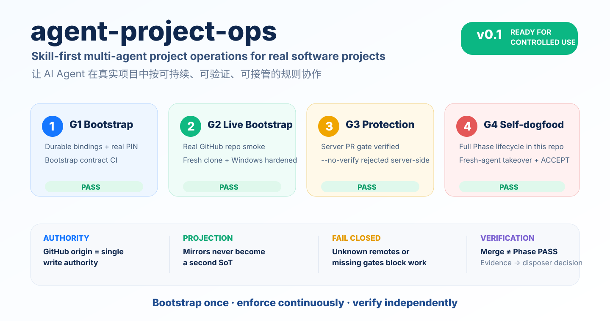
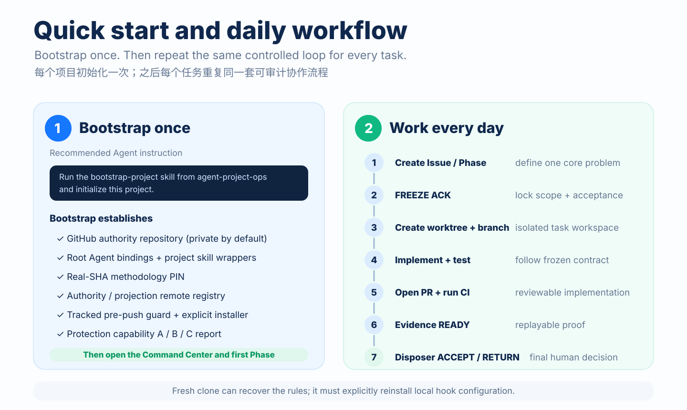
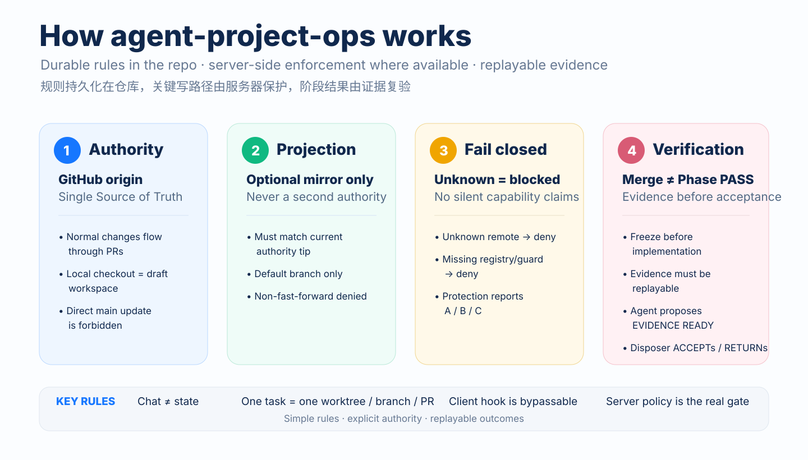
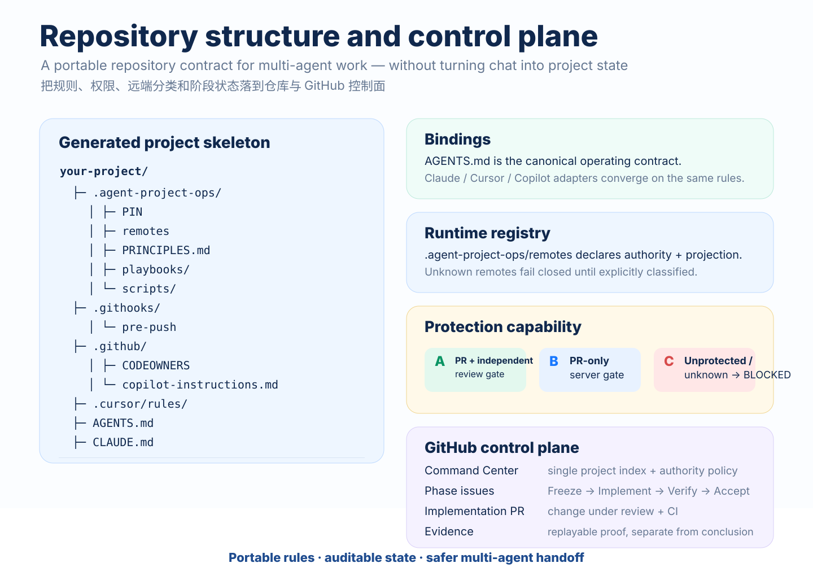

<p align="center">
  
</p>

<p align="center">
  <a href="./LICENSE"></a>
  <a href="./PRINCIPLES.md"></a>
  <a href="https://github.com/Dylan5237/agent-project-ops/actions/workflows/bootstrap-contract.yml"></a>
  <a href="https://github.com/Dylan5237/agent-project-ops/actions/workflows/enforcement-contract.yml"></a>
  <a href="https://github.com/Dylan5237/agent-project-ops/actions/workflows/self-dogfood-contract.yml"></a>
</p>

<p align="center">
  <b>Skill-first multi-agent project operations for real software projects.</b><br/>
  把 AI Agent 从“会写代码的聊天工具”变成可接管、可审计、可验证的项目协作者。
</p>

<p align="center">
  <a href="#quick-start--快速开始">Quick Start</a> ·
  <a href="#how-it-works--运行原理">How it works</a> ·
  <a href="#repository-contract--仓库契约">Repository contract</a> ·
  <a href="#project-map--项目地图">Docs</a> ·
  <a href="#boundaries--边界">Boundaries</a>
</p>

---

## Why / 为什么需要它

AI coding Agents can already implement features. The harder problem is **project continuity and control**:

- Which repository is authoritative?
- Can two Agents push different truths to different remotes?
- Does a fresh clone know the same rules as the previous session?
- Who is allowed to decide that a Phase actually passed?
- Can a human reviewer replay the evidence without reading the original chat?

`agent-project-ops` turns those questions into a repository-level operating contract.

> **GitHub is the write authority. Chat is not project state. Merge is not Phase PASS.**

This repository is a **methodology and enforcement toolkit**, not an application framework. It deliberately contains no business-domain SOP, runtime stack, low-code engine, or product lifecycle model.

## Highlights

| Capability | What it means |
| --- | --- |
| **Durable Agent binding** | `AGENTS.md` plus supported adapters keep rules discoverable after session or Agent changes. |
| **Single write authority** | GitHub `origin` is the authoritative write path; optional secondary remotes are projections only. |
| **Fail-closed Git guard** | Unknown remotes, missing registries, unsafe URLs, and invalid projection paths are denied instead of guessed. |
| **Server capability reporting** | Protection is reported honestly as **A / B / C**; unsupported protection never becomes a silent promise. |
| **One task, one isolated path** | Worktree + branch + PR keep parallel Agent work reviewable. |
| **Replayable Phase verification** | Evidence is separated from implementation conclusion; only the named disposer can Accept. |
| **Fresh-clone recovery** | A new checkout can rediscover the control plane and explicitly restore local hook configuration. |

## Quick Start / 快速开始

### Agent-first path

Clone this methodology once, then give your coding Agent a single instruction:

> **Run the `bootstrap-project` skill from `agent-project-ops` and initialize this project.**

The bootstrap path creates the project repository contract, real-SHA methodology PIN, remote registry, Agent bindings, hook entrypoint, GitHub authority repository, and protection capability report.

### CLI path

```bash
# From a real checkout of agent-project-ops
bash scripts/bootstrap-project.sh \
  --name my-project \
  --dir ../my-project \
  --disposer @OWNER \
  --no-projection \
  --private \
  --yes
```

For a second remote, declare it explicitly as a projection:

```bash
bash scripts/bootstrap-project.sh \
  --name my-project \
  --dir ../my-project \
  --disposer @OWNER \
  --projection-url git@gitlab.example:group/my-project.git \
  --private \
  --yes
```

> **Windows:** run the shell scripts with Git Bash. The repository pins shell/hook surfaces to LF.

<p align="center">
  
</p>

After bootstrap, use [`playbooks/start-project.md`](./playbooks/start-project.md):

**Command Center → first Phase → FREEZE ACK → worktree/branch → implementation PR → CI → evidence → PHASE ACCEPT / RETURN**

## How it works / 运行原理

`agent-project-ops` separates four concerns that often get mixed together in Agent-driven projects:

<p align="center">
  
</p>

### 1. Authority

GitHub `origin` is the **single write authority**. Local repositories are workspaces, not alternate truth stores. Normal updates to an existing default branch go through PRs.

### 2. Projection

An optional GitLab or other remote can be registered as a **projection**. A projection must follow the current authority tip and must never become a fallback write authority.

### 3. Fail closed

Unknown remote? Missing registry? Unsafe remote URL? Protection cannot be verified? The methodology blocks or reports capability C instead of inferring permission.

### 4. Verification

A merged implementation is not the end of the lifecycle. The Agent posts replayable evidence and proposes `EVIDENCE READY`; the named disposer decides `PHASE ACCEPT` or `PHASE RETURN`.

## Repository contract / 仓库契约

A bootstrapped business repository receives a small durable control surface. The exact generated files vary by supported adapter, but the contract is intentionally simple:

<p align="center">
  
</p>

Core pieces:

- **`AGENTS.md`** — canonical Agent operating instructions.
- **`.agent-project-ops/PIN`** — exact methodology provenance (`repo`, `ref`, real commit SHA).
- **`.agent-project-ops/remotes`** — authority/projection registry.
- **`.githooks/pre-push`** — tracked client guard entrypoint.
- **`.github/` / `.cursor/` / `CLAUDE.md` / other adapters** — supported Agent-specific entrypoints that converge on the same contract.
- **GitHub Issues + PRs** — durable control plane for Command Center, Phases, evidence, decisions, and exceptions.

### Fresh clone rule

Git does **not** clone `core.hooksPath`. A fresh checkout must verify the setting and run the tracked installer when needed:

```bash
git config --get core.hooksPath
bash .agent-project-ops/scripts/install-hooks.sh
```

A client hook is deliberately treated as a convenience guard, **not** the final security boundary. Where the hosting plan supports it, server-side branch protection is the real gate.

## Protection capability / 保护能力

Bootstrap reports what was actually verified:

| Level | Meaning | Release posture |
| --- | --- | --- |
| **A** | PR path plus an enforceable independent/code-owner review boundary | Strongest supported mode |
| **B** | PR-only server gate; no independent-human guarantee | Valid controlled-use mode |
| **C** | Unprotected, unknown, or protection cannot be verified | **BLOCKED** for workflows that require server protection |

Important example: on a personal GitHub Free account, a **private** repository may be unable to provide the required server-side branch protection. That is reported as **C**, not silently treated as protected. Public repositories can support the verified B path used in the v0.1 smoke test.

If the Agent and disposer use the **same GitHub identity**, GitHub cannot distinguish “human action” from “Agent action”; do not describe that configuration as an independent human approval security boundary.

## Verified v0.1 / 已验证状态

The current release posture was not declared from documentation alone. It passed four gates:

| Gate | Result | Evidence |
| --- | --- | --- |
| G1 — Bootstrap contract | **PASS** | PR #8 + bootstrap CI |
| G2 — Live bootstrap | **PASS** | real GitHub repository smoke + Windows hardening |
| G3 — Server protection | **PASS** | public repository rejected `git push --no-verify origin main` server-side |
| G4 — Self-dogfood | **PASS** | [Command Center #10](https://github.com/Dylan5237/agent-project-ops/issues/10), accepted [Phase #11](https://github.com/Dylan5237/agent-project-ops/issues/11), implementation PR #12, evidence PR #13 |

**v0.1 status:** ready for **real controlled use**, with the boundaries below kept explicit.

## Project Map / 项目地图

### Start here

| Document | Purpose |
| --- | --- |
| [`PRINCIPLES.md`](./PRINCIPLES.md) | The non-negotiable operating principles |
| [`playbooks/bootstrap-project.md`](./playbooks/bootstrap-project.md) | New project bootstrap contract |
| [`playbooks/start-project.md`](./playbooks/start-project.md) | Establish Command Center, protection, remotes, first Phase |
| [`playbooks/phase-lifecycle.md`](./playbooks/phase-lifecycle.md) | Freeze → Implement → Verify → Accept |
| [`playbooks/verification-and-evidence.md`](./playbooks/verification-and-evidence.md) | Replayable evidence and disposer acceptance |

### Git & collaboration

| Document | Purpose |
| --- | --- |
| [`playbooks/git-worktree.md`](./playbooks/git-worktree.md) | One task, one worktree |
| [`playbooks/git-branch-and-remote.md`](./playbooks/git-branch-and-remote.md) | Branch and remote discipline |
| [`playbooks/git-authority-and-projection.md`](./playbooks/git-authority-and-projection.md) | Authority vs projection semantics |
| [`playbooks/issues-and-prs.md`](./playbooks/issues-and-prs.md) | GitHub control-plane conventions |
| [`playbooks/blocked-and-exceptions.md`](./playbooks/blocked-and-exceptions.md) | Fail closed + Architecture Exception |
| [`playbooks/staff-and-dispatch.md`](./playbooks/staff-and-dispatch.md) | Agent ownership and dispatch |

### Agent entrypoints

| Skill | Path |
| --- | --- |
| Bootstrap project | [`skills/bootstrap-project/SKILL.md`](./skills/bootstrap-project/SKILL.md) |
| Multi-agent project ops | [`skills/github-multi-agent-project-ops/SKILL.md`](./skills/github-multi-agent-project-ops/SKILL.md) |
| Worktree and branch | [`skills/git-worktree-and-branch/SKILL.md`](./skills/git-worktree-and-branch/SKILL.md) |
| Authority and projection | [`skills/git-authority-and-projection/SKILL.md`](./skills/git-authority-and-projection/SKILL.md) |
| Issues, PRs, evidence | [`skills/issues-prs-and-evidence/SKILL.md`](./skills/issues-prs-and-evidence/SKILL.md) |

### Design & evidence

- RFCs: [`docs/rfcs/`](./docs/rfcs/)
- Research and methodology audit: [`docs/research/`](./docs/research/)
- Evidence records: [`docs/evidence/`](./docs/evidence/)
- Templates: [`templates/`](./templates/)
- Contract tests: [`tests/`](./tests/)
- GitHub Actions contracts: [`.github/workflows/`](./.github/workflows/)

## Boundaries / 边界

`agent-project-ops` is intentionally strict about what it **does not** promise:

- **Not a product/app framework.** No runtime, domain SOP, deployment stack, or business workflow engine.
- **Not a secure enclave.** Repository instructions can be ignored by incompatible Agents; client hooks can be bypassed.
- **Not universal Agent compliance.** The durable binding works for Agents that read repository instructions/skills; no methodology can guarantee every Agent product obeys them.
- **Not a second control plane.** GitHub Issues/PRs + git remain authoritative; chat is context, not state.
- **Not Agent self-approval.** Agents propose; the named disposer freezes, Accepts, Returns, or accepts exceptions.
- **Not GitLab-as-authority.** A second remote is projection/mirror only unless a future methodology explicitly changes the authority model.
- **Not silently latest.** Business repositories pin a methodology SHA. Updates are explicit.

## Contributing / 使用与改进

This repository currently treats methodology changes like any other controlled project change: open an Issue, keep the scope narrow, use a branch/PR, and attach replayable evidence when the claim requires it.

For current internal control-plane state, see [Command Center #10](https://github.com/Dylan5237/agent-project-ops/issues/10).

## License

[MIT](./LICENSE)
