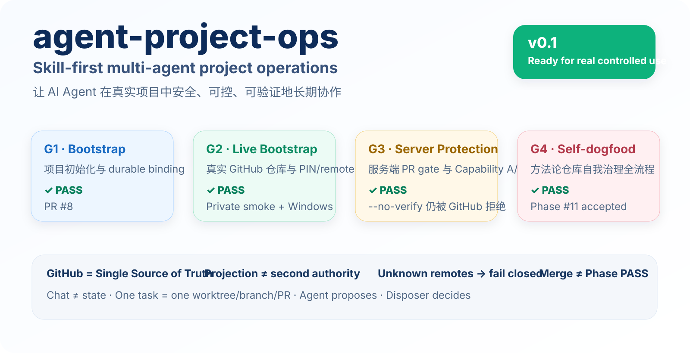
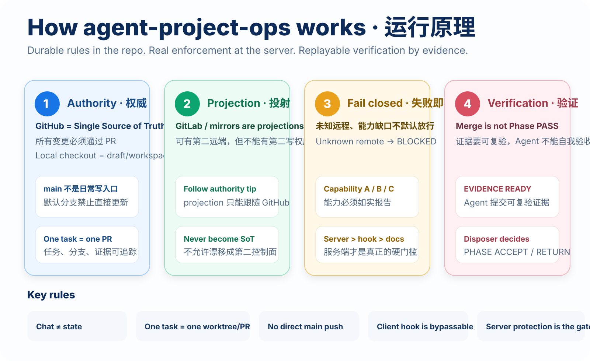

<p align="center">
  
</p>

<p align="center">
  <a href="./LICENSE"></a>
  
  
  
  <a href="https://github.com/Dylan5237/agent-project-ops/actions/workflows/bootstrap-contract.yml"></a>
  <a href="https://github.com/Dylan5237/agent-project-ops/actions/workflows/enforcement-contract.yml"></a>
</p>

<p align="center">
  <strong>Bootstrap once. Enforce continuously. Verify independently.</strong><br/>
  把 AI Agent 从“这次对话里的临时助手”，变成真实项目中可持续、可审计、可接力的协作成员。
</p>

---

## What is agent-project-ops?

`agent-project-ops` 是一套 **Skill-first 的多 Agent 项目治理方法论**。

它不提供业务框架，不替你写产品 SOP，也不试图发明新的代码托管平台。它解决的是更底层的问题：

> 当本地 Coding Agent、ChatGPT、Claude Code、Cursor、Copilot 等 AI 长期参与真实软件项目时，如何让项目状态、写权威、分支纪律、验证证据和人类拍板边界不随着会话切换而失控？

核心答案很简单：

- **GitHub `origin` 是唯一写权威 / Single Source of Truth**
- **Chat ≠ state**：项目事实必须落在 repo、Issue、PR、CI 和 evidence 中
- **One task = one worktree / branch / PR**
- **Projection ≠ second authority**：GitLab 或其他远端只能作为投射/镜像
- **Unknown remotes → fail closed**
- **Merge ≠ Phase PASS**：Agent 提交证据，Disposer 决定 `PHASE ACCEPT / RETURN`

> v0.1 已完成 Bootstrap、真实仓库 smoke、服务端保护绕过测试和 self-dogfood 全流程验证，可用于 **real controlled use**。

## Why this exists

很多 AI 编码流程的问题并不出在“模型不会写代码”，而出在项目运行机制没有被固化：

| 常见失控 | agent-project-ops 的约束 |
| --- | --- |
| 换一个 Agent 就不知道前情 | repo-level binding + Command Center |
| 本地 / GitHub / GitLab 三套状态漂移 | authority / projection 明确分类 |
| Agent 直接推 `main` | client hook + server-side protection |
| PR merge 就被当成“项目完成” | Phase lifecycle + evidence + disposer Accept |
| 会话里说过的决定无法追溯 | Chat ≠ state，结论进入 Issue / PR / docs |
| 多任务并行互相污染 | one task → one worktree / branch / PR |

<p align="center">
  
</p>

## Quick start

### 1. 让 Agent 初始化项目

最推荐的使用方式不是让人背命令，而是让兼容 repo instructions / skills 的 Agent 执行：

```text
Run the bootstrap-project skill from agent-project-ops and initialize this project.
```

或者从本方法论的真实 git checkout 中直接运行：

```bash
./scripts/bootstrap-project.sh \
  --name my-project \
  --disposer @your-handle \
  --no-projection \
  --yes
```

Bootstrap 会：

1. 初始化项目 git 仓库；
2. 写入 durable Agent bindings；
3. 写入真实 SHA 的 `.agent-project-ops/PIN`；
4. 建立 authority / projection remote registry；
5. 安装 tracked pre-push hook；
6. 创建 GitHub authority（除非显式 `--skip-github`）；
7. 尝试配置 server-side protection；
8. 如实报告 Capability **A / B / C**。

### 2. 选择仓库可见性时理解保护能力

| Capability | 含义 | 结果 |
| --- | --- | --- |
| **A** | PR + 独立 reviewer / code-owner gate 可验证 | strongest |
| **B** | PR required，管理员也受保护，但无独立人类身份保证 | accepted for controlled use |
| **C** | protection 不可用或不可验证 | **BLOCKED / fail closed** |

> GitHub Free 的 **private repository** 无法提供这里要求的服务端 branch protection，因此会被正确报告为 Capability C。GitHub Free 的 public repository 可验证 Capability B。client hook 可以被 `--no-verify` 绕过，因此它从来不是最终安全边界。

<p align="center">
  
</p>

## Daily workflow

项目初始化后，日常任务遵循同一条主链：

```text
Issue / Phase
    ↓
Freeze contract
    ↓
FREEZE ACK (Disposer)
    ↓
Worktree + branch
    ↓
Implement + test
    ↓
Pull Request + CI
    ↓
Evidence READY (Agent proposes)
    ↓
PHASE ACCEPT / RETURN (Disposer decides)
```

关键点：

- Freeze 之前不进入实现；
- Agent 可以自主推进实现、测试、CI、证据整理；
- 遇到真正需要产品/架构拍板的点才暂停；
- PR merge 只是代码进入 authority，不等于 Phase PASS；
- `PHASE ACCEPT`、`PHASE RETURN`、`EXCEPTION ACCEPT` 属于 disposer 权限。

详见 [Phase lifecycle](./playbooks/phase-lifecycle.md) 与 [Verification & evidence](./playbooks/verification-and-evidence.md)。

## What gets written into a project?

Bootstrap 的目标不是复制一大套框架，而是留下足够的 **durable control surface**，让未来的新 Agent 能重新接管项目。

<p align="center">
  
</p>

典型生成结构：

```text
your-project/
├── AGENTS.md                         # canonical Agent instructions
├── CLAUDE.md                         # adapter → AGENTS.md
├── .agent-project-ops/
│   ├── PIN                           # pinned methodology repo/ref/SHA
│   ├── remotes                       # authority / projection registry
│   ├── PRINCIPLES.md                 # pinned methodology snapshot
│   ├── playbooks/
│   └── scripts/
├── .agents/skills/                   # project-facing skill wrappers
├── .githooks/pre-push                # client-side guard
├── .github/
│   ├── CODEOWNERS
│   └── copilot-instructions.md
├── .cursor/rules/
├── .continue/rules/
└── ... your product code
```

### Fresh clone rule

Git 不会克隆本地 `core.hooksPath` 配置。新 clone 必须检查：

```bash
git config --get core.hooksPath
```

如果不是 `.githooks`：

```bash
bash .agent-project-ops/scripts/install-hooks.sh
```

这不是安全边界，而是本地开发阶段的早期拦截；真正不可绕过的关键路径应该交给 GitHub server-side protection。

## Authority and projection

默认推荐：**只有 `origin`**。

如果业务确实需要 GitLab / 其他 git host：

```text
GitHub origin
   │
   │  sole write authority
   ▼
 accepted main
   │
   └────────────► GitLab / mirror / deployment projection
                  projection only
```

Projection 的约束：

- 只能投射 authority 已接受状态；
- 不能成为第二个写权威；
- 不能把未知 remote 当作“可能是 origin”；
- projection 首次 seed 也必须等于当前 authority tip；
- 非 fast-forward projection update 被拒绝。

详见 [Git authority & projection](./playbooks/git-authority-and-projection.md)。

## Project control plane

GitHub Issues / PRs 是运行中的控制面，不是聊天记录。

| Object | Purpose |
| --- | --- |
| **Command Center** | 单一项目索引：disposer、authority、protection、Phase index、blocks |
| **Phase issue** | 一个阶段只解决一个核心问题；承载 Freeze / Accept 生命周期 |
| **Task issue** | 可选的 Phase 子任务 |
| **Implementation PR** | 实现 diff；不混入 proof-only dump |
| **Evidence PR / proof comment** | 可复验的验证证据 |
| **Architecture Exception** | 已冻结合同必须改变时 fail closed，不静默改口径 |

## Playbooks

| Playbook | Use it for |
| --- | --- |
| [bootstrap-project](./playbooks/bootstrap-project.md) | new repo + durable binding + authority |
| [start-project](./playbooks/start-project.md) | Command Center + protection + first Phase |
| [phase-lifecycle](./playbooks/phase-lifecycle.md) | Freeze → Implement → Verify → Accept |
| [staff-and-dispatch](./playbooks/staff-and-dispatch.md) | Agent roster and dispatch |
| [git-worktree](./playbooks/git-worktree.md) | one task, one isolated worktree |
| [git-branch-and-remote](./playbooks/git-branch-and-remote.md) | branch rules and origin discipline |
| [git-authority-and-projection](./playbooks/git-authority-and-projection.md) | optional projection / mirror |
| [issues-and-prs](./playbooks/issues-and-prs.md) | Issue / PR / status conventions |
| [verification-and-evidence](./playbooks/verification-and-evidence.md) | replayable evidence and Accept |
| [blocked-and-exceptions](./playbooks/blocked-and-exceptions.md) | blocked state and Architecture Exception |

## Agent skills

| Skill | Entry point |
| --- | --- |
| Bootstrap project | [skills/bootstrap-project/SKILL.md](./skills/bootstrap-project/SKILL.md) |
| GitHub multi-Agent project ops | [skills/github-multi-agent-project-ops/SKILL.md](./skills/github-multi-agent-project-ops/SKILL.md) |
| Git worktree and branch | [skills/git-worktree-and-branch/SKILL.md](./skills/git-worktree-and-branch/SKILL.md) |
| Git authority and projection | [skills/git-authority-and-projection/SKILL.md](./skills/git-authority-and-projection/SKILL.md) |
| Issues, PRs, and evidence | [skills/issues-prs-and-evidence/SKILL.md](./skills/issues-prs-and-evidence/SKILL.md) |

## For an existing repository

Session-only adoption is useful, but不是 durable binding：

```text
Load https://github.com/Dylan5237/agent-project-ops,
read PRINCIPLES.md and the relevant skills,
and follow the playbooks.
```

如果准备长期使用，应按 [start-project](./playbooks/start-project.md) 明确加入 repo-level bindings、Command Center、remote registry 和 protection capability，而不是假设后续 Agent 会记得这次聊天。

## Design boundaries

`agent-project-ops` 刻意保持小而清晰：

- **Not a product/app framework** — 不提供 runtime、领域模型、业务流程或 deploy stack；
- **Not a secure enclave** — instruction files 可以被忽略，client hook 可以被绕过；
- **Not a second control plane** — GitHub Issues/PRs + git remain authoritative；
- **Not a license to self-Accept** — Agent proposes, disposer accepts；
- **Not GitLab-as-authority** — 第二远端只能是 projection 或 out of scope；
- **Not silently latest** — 业务仓库 PIN 到真实 methodology SHA，升级必须显式发生；
- **Not universal Agent compliance** — 任何机制都不能保证所有第三方 Agent 100% 遵守 repo instructions。

## Verified v0.1 gates

| Gate | Evidence | Result |
| --- | --- | --- |
| G1 Bootstrap contract | PR #8 + bootstrap CI | ✅ PASS |
| G2 Live bootstrap | private/public real repo smoke + Windows hardening | ✅ PASS |
| G3 Server protection | public repo `--no-verify` direct-main push rejected by GitHub | ✅ PASS |
| G4 Self-dogfood | Command Center #10 → Phase #11 → PR #12 → Evidence #13 → disposer Accept | ✅ PASS |

Self-dogfood evidence: [docs/evidence/phase-11-self-dogfood.md](./docs/evidence/phase-11-self-dogfood.md).

## Repository map

- Core principles: [PRINCIPLES.md](./PRINCIPLES.md)
- RFCs: [docs/rfcs/](./docs/rfcs/)
- Research & methodology audit: [docs/research/](./docs/research/)
- Evidence: [docs/evidence/](./docs/evidence/)
- Issue / PR / binding templates: [templates/](./templates/)
- Enforcement tests: [tests/](./tests/)
- GitHub Actions contracts: [.github/workflows/](./.github/workflows/)
- Worktree helper: [scripts/new-worktree.sh](./scripts/new-worktree.sh)

## License

[MIT](./LICENSE)
