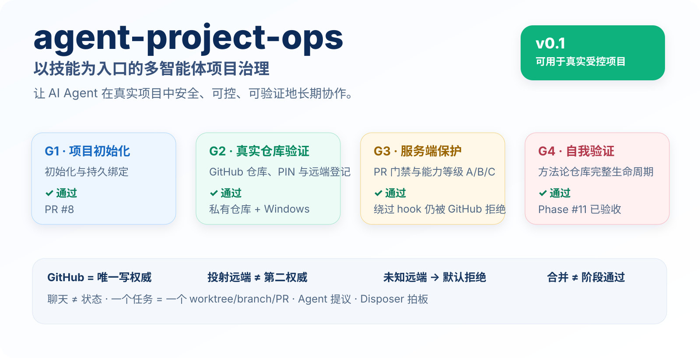
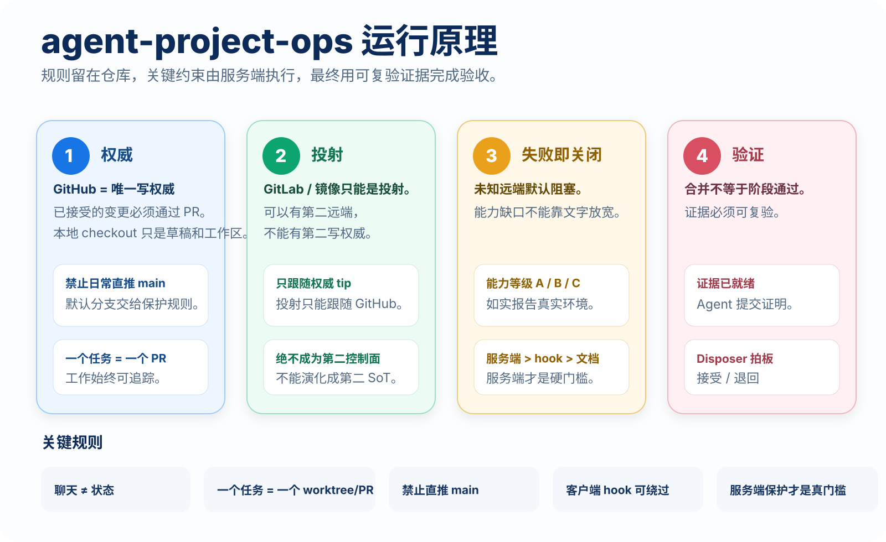

<p align="right">
  <a href="./README.md">English</a> · <strong>简体中文</strong>
</p>

<p align="center">
  
</p>

<p align="center">
  <a href="./LICENSE"></a>
  
  
  
  <a href="https://github.com/Dylan5237/agent-project-ops/actions/workflows/bootstrap-contract.yml"></a>
  <a href="https://github.com/Dylan5237/agent-project-ops/actions/workflows/enforcement-contract.yml"></a>
</p>

<p align="center">
  <strong>一次初始化，持续约束，独立验证。</strong><br/>
  把 AI Agent 从“某次聊天里的临时助手”，变成真实项目中可持续、可审计、可接力的协作成员。
</p>

<p align="center">
  <a href="./docs/GETTING_STARTED.zh-CN.md"><strong>快速上手</strong></a> ·
  <a href="./PRINCIPLES.md">核心原则</a> ·
  <a href="./playbooks/">运行手册</a> ·
  <a href="./skills/">技能入口</a> ·
  <a href="./docs/evidence/phase-11-self-dogfood.md">自我验证证据</a>
</p>

---

## agent-project-ops 是什么？

`agent-project-ops` 是一套 **以 Skill 为入口的多 Agent 项目治理方法论**。

它不提供应用框架、业务 SOP、运行时或部署栈。它解决的是一个更底层的问题：

> 当 ChatGPT、Claude Code、Cursor、Copilot 和本地 Coding Agent 长期参与真实软件项目时，如何让项目状态、写权威、分支纪律、验证证据和人类拍板边界不随着会话和工具切换而失控？

核心规则刻意保持精简：

| 规则 | 含义 |
| --- | --- |
| **GitHub `origin` = 写权威** | 只有一个写权威；其他远端只能是投射 |
| **聊天 ≠ 状态** | 项目事实必须进入仓库、Issue、PR、CI 和证据 |
| **一个任务 = 一个 worktree / branch / PR** | 并行工作彼此隔离且可追踪 |
| **未知远端默认拒绝** | 未分类远端不能被猜测为可信 |
| **合并 ≠ Phase PASS** | Agent 提交证据，Disposer 决定 `ACCEPT / RETURN` |
| **服务端保护才是真门槛** | 客户端 hook 可以被绕过，不能作为最终安全边界 |

> v0.1 已完成真实仓库初始化、服务端保护绕过测试、fresh clone 恢复和完整 self-dogfood 生命周期验证，可用于 **真实受控项目**。

## 3 分钟开始

### 推荐方式：直接告诉兼容 Agent 你的目标

```text
Run the bootstrap-project skill from agent-project-ops and initialize this project.
```

### 或直接执行初始化脚本

```bash
bash scripts/bootstrap-project.sh \
  --name my-project \
  --dir ../my-project \
  --github OWNER/my-project \
  --disposer @OWNER \
  --no-projection \
  --private \
  --yes
```

初始化会写入持久化仓库绑定、固定方法论 SHA、安装本地 tracked hook、登记 authority / projection 远端、创建 GitHub `origin`，并如实报告保护能力等级 **A / B / C**。

**下一步 → [快速上手](./docs/GETTING_STARTED.zh-CN.md)**，查看保护能力选择、fresh clone 恢复、Command Center 建立、日常 Phase 流程和投射规则。

> GitHub Free + **私有仓库** 无法提供本方法论要求的服务端分支保护，因此会被正确报告为 **Capability C / BLOCKED**。客户端 hook 可被 `--no-verify` 绕过，真正的硬门槛是服务端保护。

<p align="center">
  
</p>

## 初始化后项目发生什么变化？

项目不会多出一套业务框架，而是得到一层很小、但可持久化的治理表面：

```text
your-project/
├── AGENTS.md                     # Agent 统一规则
├── CLAUDE.md                     # 适配器 → AGENTS.md
├── .agent-project-ops/
│   ├── PIN                       # 固定的方法论 repo/ref/SHA
│   ├── remotes                   # 权威 / 投射登记
│   ├── PRINCIPLES.md
│   ├── playbooks/
│   └── scripts/
├── .agents/skills/               # 面向项目的技能入口
├── .githooks/pre-push            # 可绕过的本地保护
├── .github/CODEOWNERS
├── .github/copilot-instructions.md
├── .cursor/rules/
└── ... 你的业务代码
```

一个新的兼容 Agent 应该可以仅凭持久状态恢复写权威、规则、控制面指针和接力路径，而不依赖最初那次 bootstrap 聊天。

完整结构和接管流程见 [快速上手](./docs/GETTING_STARTED.zh-CN.md#4-bootstrap-会写入什么)。

## 日常运行模型

```text
Issue / Phase → Freeze → Worktree / Branch → 实现 → PR / CI
                                          ↓
                                     可复验证据
                                          ↓
                               Disposer 接受 / 退回
```

Agent 可以自主推进实现、测试、CI 检查和证据整理；只有到了 Freeze、Accept、Return、Architecture Exception 等真正的 disposer 决策边界才暂停。

详细流程：[phase-lifecycle](./playbooks/phase-lifecycle.md) · [verification-and-evidence](./playbooks/verification-and-evidence.md)

## 保护能力等级

| 等级 | 服务端状态 | 项目结论 |
| --- | --- | --- |
| **A** | PR + 可独立强制执行的 reviewer / code-owner 门禁 | 最强 |
| **B** | 必须 PR + 管理员也受保护；但无法独立保证“人类身份” | 可用于受控场景 |
| **C** | 保护不可用或无法验证 | **BLOCKED / 默认阻塞** |

`agent-project-ops` 不会靠措辞把 Capability C 说成“够用了”。能力等级必须来自真实环境。

## 已验证的 v0.1

| 验证项 | 结果 |
| --- | --- |
| Bootstrap contract | ✅ 通过 |
| 真实 private / public 仓库初始化 smoke | ✅ 通过 |
| `git push --no-verify origin main` 被服务端拒绝 | ✅ 通过 |
| Fresh clone hook 恢复 | ✅ 通过 |
| 完整 self-dogfood：Command Center → Phase → 实现 → 证据 → disposer Accept | ✅ 通过 |

可复验证据：[docs/evidence/phase-11-self-dogfood.md](./docs/evidence/phase-11-self-dogfood.md)

## 文档导航

| 从这里开始 | 用途 |
| --- | --- |
| **[快速上手](./docs/GETTING_STARTED.zh-CN.md)** | 初始化、保护能力、首个项目、日常流程 |
| [PRINCIPLES.md](./PRINCIPLES.md) | 不可妥协的设计原则 |
| [playbooks/](./playbooks/) | 运行流程 |
| [skills/](./skills/) | Agent 入口 |
| [docs/rfcs/](./docs/rfcs/) | 设计合同 |
| [docs/research/](./docs/research/) | 调研与审计历史 |
| [docs/evidence/](./docs/evidence/) | 可复验验收证据 |
| [templates/](./templates/) | 绑定 / Issue / PR 模板 |
| [tests/](./tests/) | 约束与 bootstrap contract |

## 设计边界

本项目明确**不声称**以下能力：

- 提供产品 / 应用运行时、领域模型、部署栈或业务 SOP；
- 保证所有第三方 Agent 都 100% 遵守仓库 instructions；
- 把客户端 hook 当成安全边界；
- 把 GitLab 或其他镜像当作第二事实源；
- 把 PR 合并直接等同于项目验收；
- 自动漂移到方法论最新版本。

业务仓库会固定到真实方法论 SHA。Agent 提议，命名的 disposer 负责验收。

## 许可证

[MIT](./LICENSE)
