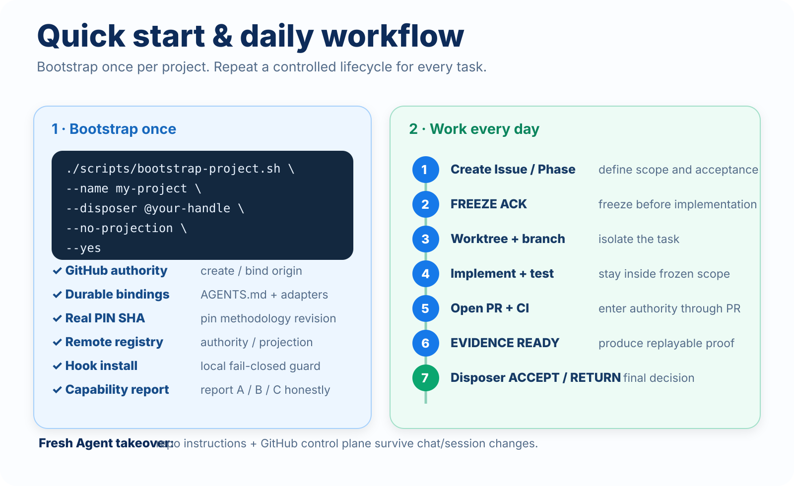
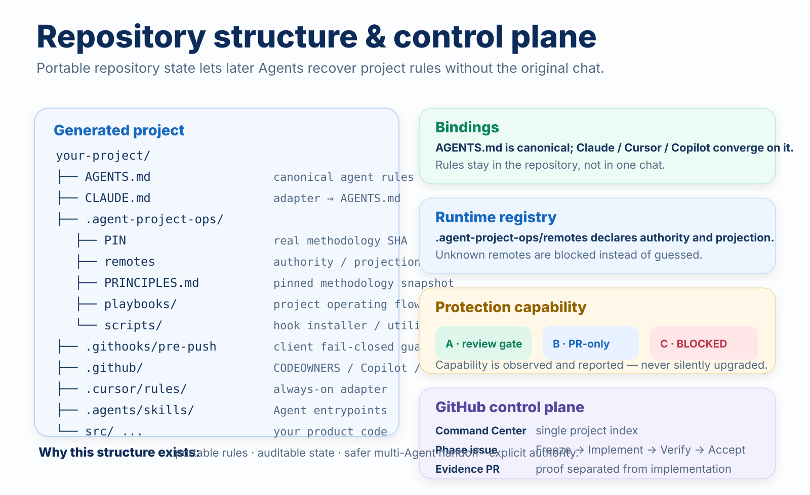

<p align="right">
  <strong>English</strong> · <a href="./GETTING_STARTED.zh-CN.md">简体中文</a>
</p>

# Getting Started

This guide is the shortest path from **“I want AI Agents to work on a real project”** to a repository with durable project governance.

`agent-project-ops` is a methodology and control layer. It does not replace your application architecture, runtime, deployment stack, or product process.

---

## 1. Before you start

You need:

- Git
- Bash / Git Bash
- GitHub CLI (`gh`) if bootstrap should create or configure the GitHub repository
- a real git checkout of `agent-project-ops`
- a named human disposer, for example `@your-handle`

The disposer is the person allowed to make decisions such as:

- `FREEZE ACK`
- `PHASE ACCEPT`
- `PHASE RETURN`
- `EXCEPTION ACCEPT`

The Agent may prepare and propose these decisions, but it does not self-Accept.

---

## 2. Choose your protection posture first

The methodology reports what GitHub can actually enforce.

| Capability | Meaning | Can proceed? |
| --- | --- | --- |
| **A** | PR + independently enforceable reviewer / code-owner gate | Yes — strongest |
| **B** | PR required + admins enforced, but no independently guaranteed human identity | Yes — controlled use |
| **C** | required server protection is unavailable or cannot be verified | **No — BLOCKED** |

Important:

- client hooks can be bypassed with `--no-verify`;
- client hooks are therefore an early local guard, **not** the final security boundary;
- server-side GitHub protection is the real gate for protected branches;
- GitHub Free private repositories do not provide the required protection here, so they correctly fall to **Capability C**;
- GitHub Free public repositories can provide the PR-only protection used for Capability B.

If the same GitHub account is used by both the human disposer and Agent automation, do **not** describe that setup as an independently enforced human-review boundary.

---

## 3. Bootstrap a new project

### Preferred: ask a compatible Agent

Use this instruction:

```text
Run the bootstrap-project skill from agent-project-ops and initialize this project.
```

A compatible Agent should read the methodology, inspect the environment, and invoke the bootstrap flow rather than improvising its own project rules.

### Direct CLI

From a real checkout of this methodology:

```bash
bash scripts/bootstrap-project.sh \
  --name my-project \
  --dir ../my-project \
  --github OWNER/my-project \
  --disposer @OWNER \
  --no-projection \
  --private \
  --yes
```

For a GitHub Free account where protected private repositories are unavailable, use a public smoke/project only when public visibility is acceptable:

```bash
bash scripts/bootstrap-project.sh \
  --name my-project \
  --dir ../my-project \
  --github OWNER/my-project \
  --disposer @OWNER \
  --no-projection \
  --public \
  --yes
```

Before creating anything, you can inspect the intended plan:

```bash
bash scripts/bootstrap-project.sh \
  --name my-project \
  --dir ../my-project \
  --github OWNER/my-project \
  --disposer @OWNER \
  --no-projection \
  --dry-run
```

### Optional projection

Only add another git host when you really need a mirror/projection:

```bash
bash scripts/bootstrap-project.sh \
  --name my-project \
  --dir ../my-project \
  --github OWNER/my-project \
  --disposer @OWNER \
  --projection-url git@gitlab.example:group/my-project.git \
  --yes
```

The second remote never becomes a second source of truth.

<p align="center">
  
</p>

---

## 4. What bootstrap writes

Bootstrap creates a small durable control surface so later Agents can recover the project without the original chat.

```text
your-project/
├── AGENTS.md
├── CLAUDE.md
├── .agent-project-ops/
│   ├── PIN
│   ├── remotes
│   ├── PRINCIPLES.md
│   ├── playbooks/
│   └── scripts/
├── .agents/skills/
├── .githooks/pre-push
├── .github/
│   ├── CODEOWNERS
│   └── copilot-instructions.md
├── .cursor/rules/
├── .continue/rules/
└── ... your product code
```

Key files:

- `AGENTS.md` — canonical project instructions for Agents;
- `.agent-project-ops/PIN` — exact methodology repo/ref/SHA used by this project;
- `.agent-project-ops/remotes` — explicit authority/projection registry;
- `.githooks/pre-push` — local guard that fails closed on unregistered remotes and forbidden pushes;
- repo-specific adapter files — Claude, Cursor, Copilot, Continue, Aider, etc. converge toward the same durable rules.

The project pins a real methodology SHA. It does not silently float with methodology `main`.

<p align="center">
  
</p>

---

## 5. Verify bootstrap output

At minimum, check:

```bash
cat .agent-project-ops/PIN
cat .agent-project-ops/remotes
git remote -v
git config --get core.hooksPath
```

Expected local hook configuration:

```text
.githooks
```

Also confirm that bootstrap reports protection capability **A**, **B**, or **C** explicitly.

If protection is **C**, stop. Do not reinterpret it as “good enough.”

---

## 6. Fresh clone recovery

Git does **not** clone local `core.hooksPath` configuration.

A fresh clone contains the tracked hook files but does not automatically activate them.

Check:

```bash
git config --get core.hooksPath
```

If it is not `.githooks`, run:

```bash
bash .agent-project-ops/scripts/install-hooks.sh
```

Then verify again:

```bash
git config --get core.hooksPath
```

This behavior is intentional and tested. The methodology fails closed rather than pretending clone-local Git config is portable.

---

## 7. Authority and projection

Default recommendation: **use only `origin`**.

When a second git host is required:

```text
GitHub origin
   │
   │ sole write authority
   ▼
accepted main
   │
   └────────────► GitLab / mirror / deployment projection
                  projection only
```

Rules:

1. `origin` is the sole write authority;
2. unknown remotes are blocked until classified;
3. topic branches go to authority;
4. projection accepts only the authority-approved default branch state;
5. first projection seed must match the current authority tip;
6. non-fast-forward projection updates are rejected;
7. projection never becomes a second control plane.

See [git-authority-and-projection](../playbooks/git-authority-and-projection.md).

---

## 8. Start the project control plane

Bootstrap creates the durable repository binding. The next step is to establish the project operating state.

Follow [start-project](../playbooks/start-project.md) to create:

- Command Center
- disposer record
- authority/projection record
- protection capability record
- project labels
- first Phase

The Command Center is the durable index for the project. Chat is not the project index.

---

## 9. Daily Phase workflow

The normal lifecycle is:

```text
1. Create Issue / Phase
2. Freeze the scope and acceptance tests
3. Disposer: FREEZE ACK
4. Create one worktree / branch for the task
5. Implement + test
6. Open PR + run CI
7. Produce replayable evidence
8. Agent: EVIDENCE READY
9. Disposer: PHASE ACCEPT or PHASE RETURN
10. Close Phase
```

Rules that matter most:

- no implementation before Freeze when the Phase contract requires it;
- one task = one worktree / branch / PR;
- no routine direct push to `main`;
- Agent may autonomously implement, test, inspect CI, and prepare evidence;
- Agent pauses when a real product/architecture/disposer decision is required;
- PR merge does **not** equal `PHASE ACCEPT`;
- acceptance evidence must be replayable without the original chat.

See:

- [phase-lifecycle](../playbooks/phase-lifecycle.md)
- [git-worktree](../playbooks/git-worktree.md)
- [issues-and-prs](../playbooks/issues-and-prs.md)
- [verification-and-evidence](../playbooks/verification-and-evidence.md)

---

## 10. What a fresh Agent should recover

A fresh compatible Agent entering the repository should be able to determine, from durable state:

- who the disposer is;
- which remote is the authority;
- whether any projection exists;
- where the Command Center is;
- which Phase is active;
- whether direct `main` pushes are forbidden;
- whether local hooks need installation;
- which methodology SHA the project is pinned to;
- that the Agent cannot self-Accept.

If that information only exists in an old chat, the project is not durably governed yet.

---

## 11. Existing repository adoption

A one-time chat instruction can help an Agent understand the methodology:

```text
Load https://github.com/Dylan5237/agent-project-ops,
read PRINCIPLES.md and the relevant skills,
and follow the playbooks.
```

But this is session guidance only.

For long-term use, deliberately add durable repo-level bindings, remote registry, Command Center, and protection capability. Do not assume later Agents will remember the adoption conversation.

---

## 12. Operational boundaries

`agent-project-ops` intentionally does not promise:

- a secure enclave;
- universal compliance from every third-party Agent;
- a business/domain framework;
- a deployment platform;
- GitLab as co-authority;
- that hooks cannot be bypassed;
- that a merged PR means accepted work;
- automatic trust when server-side protection is missing.

The model is simple:

> **Durable rules in the repo. Explicit authority in git. Critical enforcement at the server. Replayable evidence before human acceptance.**

---

## Next reads

- [PRINCIPLES.md](../PRINCIPLES.md) — the non-negotiable design rules
- [bootstrap-project playbook](../playbooks/bootstrap-project.md) — bootstrap contract in detail
- [start-project playbook](../playbooks/start-project.md) — establish the control plane
- [phase-lifecycle](../playbooks/phase-lifecycle.md) — run a Phase end to end
- [Agent skills](../skills/) — executable entrypoints for compatible Agents
- [Self-dogfood evidence](./evidence/phase-11-self-dogfood.md) — verified v0.1 lifecycle evidence
