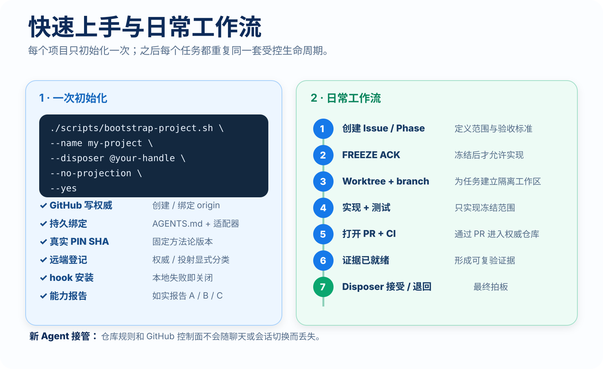
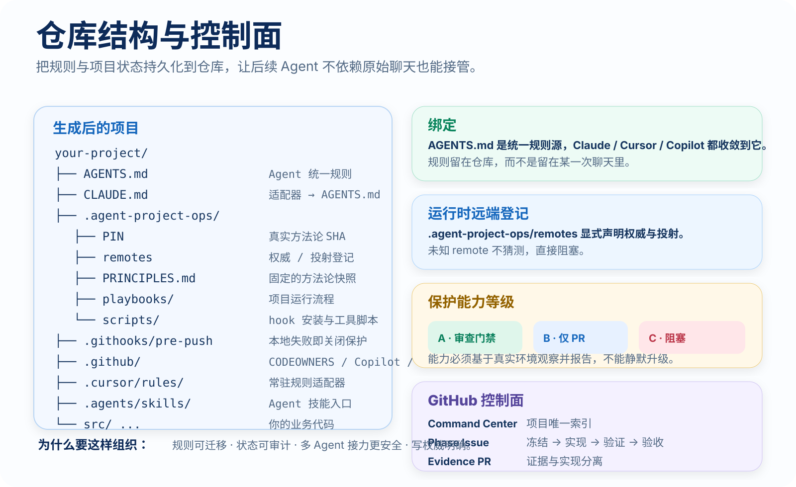

<p align="right">
  <a href="./GETTING_STARTED.md">English</a> · <strong>简体中文</strong>
</p>

# 快速上手

这份指南提供一条最短路径：从“我希望 AI Agent 真正参与项目”，到“项目已经具备可持久化治理能力”。

`agent-project-ops` 是方法论和控制层，不会替代你的应用架构、运行时、部署栈或产品流程。

---

## 1. 开始前准备

你需要：

- Git
- Bash / Git Bash
- 如果希望 bootstrap 自动创建或配置 GitHub 仓库，需要 GitHub CLI（`gh`）
- 一份真实的 `agent-project-ops` git checkout
- 一个明确的人类 disposer，例如 `@your-handle`

Disposer 是有权做这些决定的人：

- `FREEZE ACK`
- `PHASE ACCEPT`
- `PHASE RETURN`
- `EXCEPTION ACCEPT`

Agent 可以准备材料并提出建议，但不能自己完成验收。

---

## 2. 先确认保护能力等级

方法论只报告 GitHub 实际能强制执行的能力，不会靠措辞提高能力等级。

| Capability | 含义 | 是否可以继续 |
| --- | --- | --- |
| **A** | PR + 可独立强制执行的 reviewer / code-owner 门禁 | 可以，最强 |
| **B** | 必须 PR + 管理员也受保护，但无法独立保证“人类身份” | 可以，用于受控场景 |
| **C** | 所需服务端保护不可用或无法验证 | **可以 — 记录 C 并继续**（GitHub Free 私有仓上属预期；不得把 C 说成 B/A） |

需要特别注意：

- 客户端 hook 可以被 `--no-verify` 绕过；
- 因此客户端 hook 只是本地早期拦截，**不是最终安全边界**；
- 受保护分支真正的硬门槛是 GitHub server-side protection（有则用，没有不得假装有）；
- GitHub Free 私有仓库无法提供这里要求的保护，因此会正确落到 **Capability C**。这是预期结果。把 C 写入 Command Center 后继续。不要为了完成初始化去买 Pro；
- GitHub Free 公共仓库可以提供 Capability B 所需的 PR-only 保护。需要真实服务端门禁时再用 public（或 Pro），那不是完成初始化的前提。

如果人类 disposer 与 Agent 自动化使用同一个 GitHub 账号，不要把这套配置描述成“独立的人类审批硬门槛”。

---

## 3. 初始化一个新项目

### 推荐方式：让兼容 Agent 执行

直接使用这条指令：

```text
Run the bootstrap-project skill from agent-project-ops and initialize this project.
```

兼容 Agent 应该读取方法论、检查环境，然后调用 bootstrap 流程，而不是自行发明另一套项目规则。

### 直接使用 CLI

在方法论仓库的真实 checkout 中执行：

```bash
bash scripts/bootstrap-project.sh \
  --name my-project \
  --dir ../my-project \
  --github OWNER/my-project \
  --disposer @OWNER \
  --no-projection \
  --private \
  --yes
```

在 GitHub Free 上，`--private` 是合法路径，通常会报告 **Capability C**。这是预期结果：记录 C 并继续。只有在你需要真实的服务端 B 门禁、且可以公开时，才使用 `--public`（或付费方案）：

```bash
bash scripts/bootstrap-project.sh \
  --name my-project \
  --dir ../my-project \
  --github OWNER/my-project \
  --disposer @OWNER \
  --no-projection \
  --public \
  --yes
```

在真正创建任何内容前，可以先看计划：

```bash
bash scripts/bootstrap-project.sh \
  --name my-project \
  --dir ../my-project \
  --github OWNER/my-project \
  --disposer @OWNER \
  --no-projection \
  --dry-run
```

### 可选的 projection 与同事 share-export

**projection** 远端是 GitHub 的**同历史**快进镜像（含完整 ops）。只有 Command Center 把该宿主登记为 projection 时才添加 —— **不要**把同事 GitLab 填到这里。

```bash
bash scripts/bootstrap-project.sh \
  --name my-project \
  --dir ../my-project \
  --github OWNER/my-project \
  --disposer @OWNER \
  --projection-url git@git.internal.example:group/my-project.git \
  --yes
```

第二远端永远不能成为第二事实源。

**同事 GitLab** 是 [share-export](../playbooks/share-export.md)：过滤后的业务树。不要把它的 URL 当作 `--projection-url`。GitHub `origin` 建立之后：

```bash
bash scripts/share-export.sh \
  --dir ../my-project \
  --ref origin/main \
  --push git@gitlab.example:group/my-project.git \
  --yes
```

合同：[ADR 0003](./adr/0003-share-export-vs-projection.md)。若 denylist 路径（绑定、hook、Agent 入口）仍会出现在待发布树中，助手会拒绝推送。默认**保留** `.github/workflows/`，以便纯业务 CI 随导出走；Issue/PR 模板和 CODEOWNERS 会被去掉。

<p align="center">
  
</p>

---

## 4. Bootstrap 会写入什么

Bootstrap 会生成一层很小的持久化治理表面，让后续 Agent 不依赖最初那次聊天也能恢复项目状态。

```text
your-project/
├── AGENTS.md
├── CLAUDE.md
├── .agent-project-ops/
│   ├── PIN
│   ├── remotes
│   ├── PRINCIPLES.md
│   ├── playbooks/
│   └── scripts/
├── .agents/skills/
├── .githooks/pre-push
├── .github/
│   ├── CODEOWNERS
│   └── copilot-instructions.md
├── .cursor/rules/
├── .continue/rules/
└── ... 你的业务代码
```

关键文件：

- `AGENTS.md`：Agent 的统一项目指引；
- `.agent-project-ops/PIN`：项目实际绑定的方法论 repo/ref/SHA；
- `.agent-project-ops/remotes`：显式登记 authority / projection / share-export；
- `.githooks/pre-push`：本地 guard，会对未登记远端和禁止的 push fail closed；
- 各类 Agent 适配文件：Claude、Cursor、Copilot、Continue、Aider 等都尽量收敛到同一套持久规则。

项目会固定到真实的方法论 SHA，不会静默跟随 methodology `main` 漂移。

<p align="center">
  
</p>

---

## 5. 验证 bootstrap 结果

至少检查：

```bash
cat .agent-project-ops/PIN
cat .agent-project-ops/remotes
git remote -v
git config --get core.hooksPath
```

本地 hook 正常情况下应该是：

```text
.githooks
```

同时确认 bootstrap 明确报告了保护能力 **A / B / C**。

如果结果是 **C**，把 **C** 写入 Command Center 后继续。不要把它解释成 B 或 A。在 GitHub Free 私有仓上，C 是预期结果。

---

## 6. Fresh clone 恢复

Git **不会**复制本地 `core.hooksPath` 配置。

所以 fresh clone 会包含 tracked hook 文件，但不会自动启用。

先检查：

```bash
git config --get core.hooksPath
```

如果不是 `.githooks`，执行：

```bash
bash .agent-project-ops/scripts/install-hooks.sh
```

然后再次确认：

```bash
git config --get core.hooksPath
```

这是刻意设计并经过测试的行为。方法论选择 fail closed，而不是假装 clone-local Git 配置具备可移植性。

---

## 7. Authority、projection 与 share-export

默认推荐：**只使用 `origin`**。

当第二个 git host 是 **同历史 projection**（必须由 Command Center 登记为 projection）时：

```text
GitHub origin
   │
   │ 唯一写权威（完整 ops 树）
   ▼
accepted main
   │
   └────────────► 内部 git 宿主 / 部署投射
                  同一批 commit，仅快进
```

当第二个宿主是 **同事 GitLab** 时，**不是**上图：

```text
GitHub origin  （SoT + ops）
   │
   │ scripts/share-export.sh（去掉 denylist）
   ▼
同事 GitLab  （仅业务文件；不是 SoT；SHA 也不同）
```

规则：

1. `origin` 是唯一写权威；
2. 未知 remote 在完成分类前必须阻塞；
3. topic branch 推送到 authority；
4. projection 只能接受 authority 已通过的默认分支状态，且必须是**同一历史**；
5. 第一次 projection seed 也必须等于当前 authority tip；
6. non-fast-forward projection update 会被拒绝；
7. projection 不能变成第二控制面；
8. 同事 GitLab 使用 [share-export](../playbooks/share-export.md)，禁止对绑定后的 clone 做 `git push --mirror`。

详见 [git-authority-and-projection](../playbooks/git-authority-and-projection.md) 与 [share-export](../playbooks/share-export.md)。

---

## 8. 建立项目控制面

Bootstrap 负责建立持久化仓库绑定。下一步是建立项目运行状态。

按照 [start-project](../playbooks/start-project.md) 创建：

- Command Center
- disposer 记录
- authority / projection / share-export 记录
- protection capability 记录
- 项目 labels
- 第一个 Phase

Command Center 是项目的持久索引；聊天不是项目索引。

---

## 9. 日常 Phase 工作流

标准生命周期：

```text
1. 创建 Issue / Phase
2. 冻结范围与验收标准
3. Disposer：FREEZE ACK
4. 为任务创建唯一 worktree / branch
5. 实现 + 测试
6. 打开 PR + 运行 CI
7. 生成可复验证据
8. Agent：EVIDENCE READY
9. Disposer：PHASE ACCEPT 或 PHASE RETURN
10. 关闭 Phase
```

最重要的规则：

- 如果 Phase 合同要求 Freeze，就不能在 Freeze 前进入实现；
- 一个任务 = 一个 worktree / branch / PR；
- 日常禁止直接 push `main`；
- Agent 可以自主实现、测试、检查 CI、整理证据；
- 当真正需要产品、架构或 disposer 决策时，Agent 才暂停；
- PR merge **不等于** `PHASE ACCEPT`；
- 验收证据必须在没有原始聊天的情况下仍可复验。

详见：

- [phase-lifecycle](../playbooks/phase-lifecycle.md)
- [git-worktree](../playbooks/git-worktree.md)
- [issues-and-prs](../playbooks/issues-and-prs.md)
- [verification-and-evidence](../playbooks/verification-and-evidence.md)

---

## 10. 新 Agent 应该能恢复什么

一个新的兼容 Agent 进入仓库后，应该能够仅凭持久状态确定：

- disposer 是谁；
- 哪个 remote 是 authority；
- 是否存在 projection；
- 同事 GitLab 是否被分类为 share-export 而不是 projection；
- Command Center 在哪里；
- 当前活动 Phase 是哪个；
- 是否禁止直接 push `main`；
- 本地 hook 是否需要安装；
- 当前项目固定到了哪个 methodology SHA；
- Agent 不能 self-Accept。

如果这些信息只存在于旧聊天里，这个项目还没有真正做到持久治理。

---

## 11. 已有仓库接入

存量仓是 **adoption**，不是 greenfield bootstrap。按 **[adopt-existing-project](../playbooks/adopt-existing-project.md)** 执行。不要对非空目录跑 `scripts/bootstrap-project.sh` — 助手会先做反置 SoT 扫描再拒绝覆盖。

**第一步**（写 PIN 之前）：核对并改写本地 `AGENTS.md`（以及 Claude / Cursor / Copilot 适配文件），使远程合同与 [templates/AGENTS.md](../templates/AGENTS.md) 同向：

- GitHub `origin` = 唯一写权威；
- 投影可选（同历史快进）；
- 同事 GitLab = share-export，**不是** projection。

**反置合同是反模式（必须修）：** 把 GitLab（或任何不是 GitHub Issues 权威的宿主）写成唯一生产 / 写权威，并把 GitHub 降为「仅镜像」。若 release 技能仍消费投影默认枝 tip，`AGENTS.md` 必须区分 **write authority tip** 与 **deploy/manifest tip**，不得把后者写成写权威 / 事实源。

```bash
python3 scripts/scan-inverted-sot.py --root /path/to/business-repo
```

退出码 `1` 则 PIN 绑定 fail closed。命中项不是可选文案问题。

一次性聊天指令只能帮 Agent 找到手册：

```text
Load https://github.com/Dylan5237/agent-project-ops,
read PRINCIPLES.md and playbooks/adopt-existing-project.md,
and follow adoption — do not treat this chat as the binding.
```

这只是 session guidance。持久绑定是改写后的规则文件 + PIN + Command Center。不要假设后续 Agent 会记得这次接入聊天。

---

## 12. 运行边界

`agent-project-ops` 明确不承诺：

- secure enclave；
- 所有第三方 Agent 都 100% 遵守规则；
- 业务 / 领域框架；
- 部署平台；
- GitLab 与 GitHub 共同作为 authority；
- 把 GitLab 当成含 `agent-project-ops` 绑定的全量 projection；
- hook 无法被绕过；
- PR merge 自动代表工作通过验收；
- 缺少 server-side protection 时仍可以默认信任。

它的模型很简单：

> **规则持久化到仓库。Git 中明确写权威。关键门槛由服务端执行。人类验收前必须有可复验证据。**

---

## 接下来阅读

- [PRINCIPLES.md](../PRINCIPLES.md)：不可妥协的设计原则
- [ADR 0004](./adr/0004-free-private-capability-c.md)：Free 私有仓 Capability C 属预期
- [bootstrap-project playbook](../playbooks/bootstrap-project.md)：初始化合同细节
- [adopt-existing-project playbook](../playbooks/adopt-existing-project.md)：存量仓先改 AGENTS.md；反置 SoT fail closed
- [share-export playbook](../playbooks/share-export.md)：同事 GitLab = 过滤后的业务树
- [start-project playbook](../playbooks/start-project.md)：建立控制面
- [phase-lifecycle](../playbooks/phase-lifecycle.md)：完整运行一个 Phase
- [Agent skills](../skills/)：兼容 Agent 的执行入口
- [Self-dogfood evidence](./evidence/phase-11-self-dogfood.md)：v0.1 已验证生命周期证据
