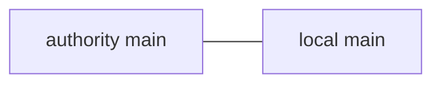
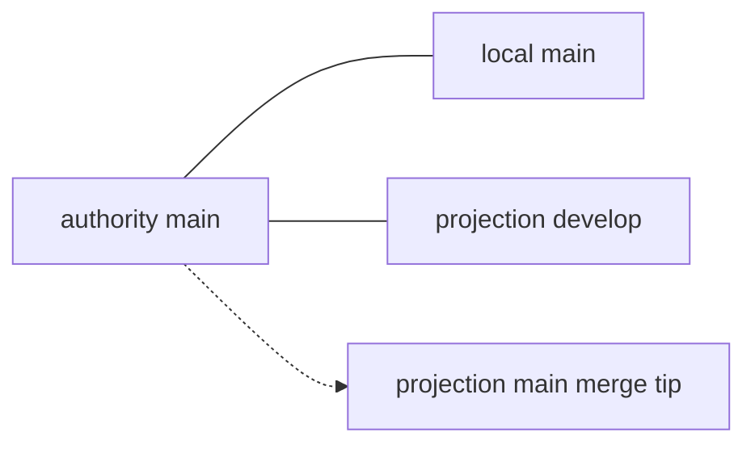

# Reconciliation report skeleton

## Topology + pins
## Now (diagram)
## Before → after
## Disposition table (reclaimed / deleted / held / blocked / unreachable)
## Backlog Issues still open
## Residual debt

T1:

T2:

